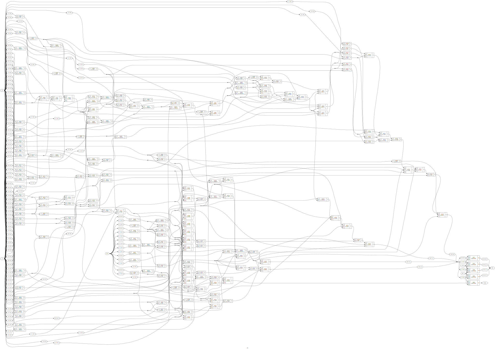
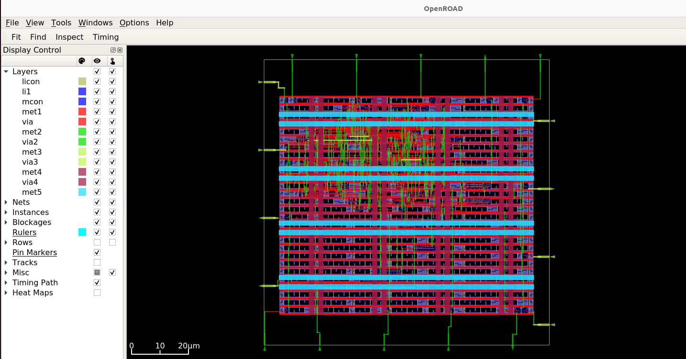

# 4-Bit ALU Physical Design (Sky130)

## Overview
This project demonstrates the complete ASIC physical design flow (RTL-to-GDSII) for a synchronous 4-bit ALU. The flow was executed using the OpenLane automated toolchain targeting the SkyWater 130nm open-source PDK. 

## Key Metrics
* **Technology Node:** SkyWater 130nm (`sky130_fd_sc_hd`)
* **Clock Target:** 100 MHz (10.0 ns period)
* **Timing Closure:** Met with +4.86 ns Setup Slack (WNS)
* **Core Utilization:** 50%

## Design Visuals
### 1. Synthesized Gate-Level Schematic
The logic synthesis (Yosys) mapped the high-level RTL operators (including division and multiplication) to standard cells.

### 2. Physical Layout 
The final floorplanned, placed, and routed design (OpenROAD).

